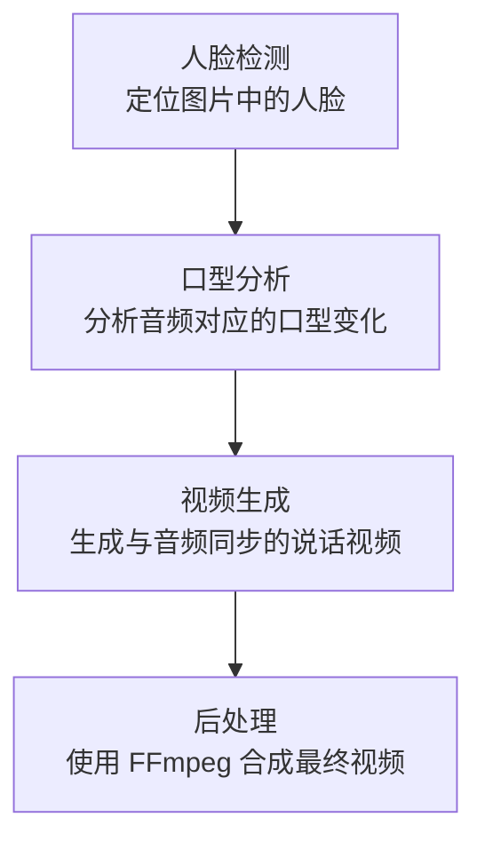

# FFmpeg
是一个开源的、跨平台的音视频处理工具和开发库，可以说是音视频领域的"瑞士军刀"。

## 🎯 主要用途
- 视频/音频转码：在不同格式之间转换（如 MP4 → AVI, MP3 → WAV）
- 视频剪辑/合并：剪切、拼接视频片段
- 格式转换：支持几乎所有常见的音视频格式
- 流媒体处理：直播推流、拉流、转码
- 屏幕录制：录制桌面或摄像头画面

## 🔧 组成部分
- ffmpeg：命令行工具，用于转码、转换等操作
- ffplay：简单的媒体播放器
- ffprobe：媒体文件分析工具
# 权重
## 🎯 权重是什么？
在AI领域，"权重"就是模型通过学习大量数据后得到的参数和知识。可以理解为：

📚 就像人类的大脑经验：通过学习获得的知识存储

💾 模型的核心数据：包含了所有学到的特征和模式

🔑 模型的"记忆"：训练成果的保存

🛠️ 权重的作用：
1. 避免重复训练
    ```python
    # 没有权重：需要从零开始训练（几天甚至几周）
    model.train_from_scratch()
    
    # 有预训练权重：直接使用已有知识
    model.load_weights("downloaded_weights.pth")
    ```
2. 提升性能
    - 模型已经在大量数据上学习过

    - 具有更好的特征提取能力

    - 收敛更快，效果更好

3. 节省资源
    ⏰ 节省时间：训练一个模型可能需要数天

    💰 节省算力：不需要昂贵的GPU训练

    📊 节省数据：不需要自己收集大量训练数据

## 📁 在 MuseTalk 中的具体用途：

- 人脸检测模型权重

- 姿态估计模型权重

- 口型同步模型权重

- 视频生成模型权重

## 🚀 为什么必须下载？
```bash
    # 如果不下载权重，运行时会报错：
    ModelNotFoundError: Cannot find model weights
    # 或者
    MissingConfigError: Pre-trained weights required
```
## 📊本项目中权重的下载位置
自动下载：运行 app.py 时会执行 download_model() ，将各权重下载到 ./models 目录，见
- 目录设定： ./app.py:33-35
- HuggingFace 模型下载： ./app.py:47-71
- Whisper tiny.pt 下载： ./app.py:73-84
- Face-Parse 与 ResNet 权重： ./app.py:86-101

# 模型的推理（生成）流程说明
📤 简单来说：输入一张人物图片 + 一段音频 → 输出一个视频，视频中的人物会按照音频内容对口型说话
## 🔧 两种推理模式：
### 1. 正态推断（Normal Inference）
    ✅ 高质量生成：效果更好，更自然
    
    ⏱️ 速度较慢：适合不要求实时性的场景
    
    🎬 适用场景：视频制作、内容创作、影视后期

### 2. 实时推理（Realtime Inference）
    ⚡ 快速生成：30fps以上，接近实时
    
    🎯 交互应用：适合直播、视频会议等
    
    🔄 预热机制：第一次处理需要准备，后续快速生成
## 💡 技术原理

# 对外接口

✅ 基础地址：`http://<服务器IP>:8181`
✅ 接口列表：
  - `GET /tts` 参数：`msg` 用途：文本转语音，返回 `{"message": "tests/<uuid>.wav"}`
  - `GET /asr` 参数：`url`（如 `tests/<key>.wav`）用途：语音识别，返回 `{"message": "<text>"}`
  - `GET /bqfk` 参数：`url`、`msId`、`index` 用途：视频抽帧与表情反馈任务，返回 `{"message":"success"}`
  - `GET /create/zbj` 参数：`username` 用途：创建直播间标识，返回 `{"message":"<zbjname>"}`
  - `GET /create/zbjv2` 参数：`username`、`job`、`count` 用途：创建直播间并生成题目，返回 `{"zbjname":"...", "question":[...]}`
  - `GET /human` 参数：`zbjname`、`audioUrl` 用途：音频切片与推理调度，返回预计时长（秒）
  - `GET /humanv2` 参数：`zbjname`、`audioUrl` 用途：触发推流播放合成视频，返回预计时长（秒）
- 依赖：Redis `localhost:6379`，密码 `123456`；相关消费进程见 `hey_tts.py`、`asr.py`、`bqfk.py`、`hey_srs.py`
- 演示页面（非 REST）：`http://<服务器IP>:7860/`

# 文件存储路径

✅ 测试与临时文件：`./tests/`
  - `./tests/<uuid>.wav` 语音生成
  - `./tests/<zbjname>_<index>.wav` 文本转语音队列产出
  - `./tests/<zbjname>_<audioUrl>.mp4` 或 `./tests/<audioUrl>.mp4` 合成视频/推流素材

✅ 推理输出与中间件：`./results/`
  - 帧图：`./results/output/<input>_<audio>/%08d.png`
  - 中间视频：`temp.mp4`
  - 最终视频：`./results/output/<input>_<audio>.mp4`
  - 输入视频重采样：`./results/input/outputxxx_<file>`

✅ 权重目录：`./models/`
  - `./models/musetalk/musetalk.json`、`./models/musetalk/pytorch_model.bin`
  - `./models/whisper/tiny.pt`
  - `./models/sd-vae-ft-mse/config.json`、`./models/sd-vae-ft-mse/diffusion_pytorch_model.bin`
  - `./models/dwpose/dw-ll_ucoco_384.pth`
  - `./models/face-parse-bisent/79999_iter.pth`、`./models/face-parse-bisent/resnet18-5c106cde.pth`

✅ 数据示例：`./data/`
  - `./data/video/output_audio.wav`
  - `./data/audio/` 示例音频

✅ 资源库：`./audios/`
  - `./audios/<file>.wav`、`./audios/<file>.mp4`

# 注意事项
- tts接口：接口返回的路径是异步生成的占位结果，实际文件由后台 TTS 消费进程生成，要想生成wav文件，要运行对应的tts.py文件 `python tts.py`
- 使用的是redis的0号库，默认端口6379，密码123456